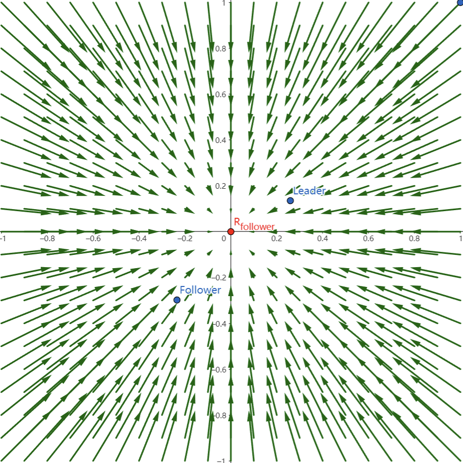
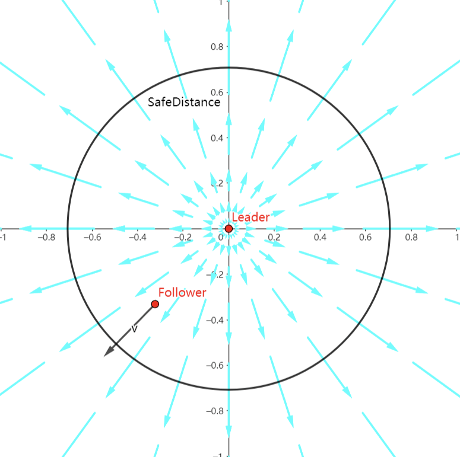
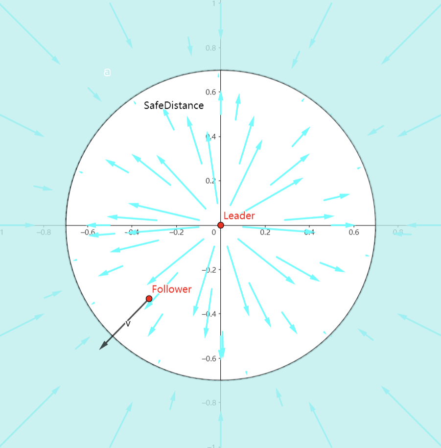
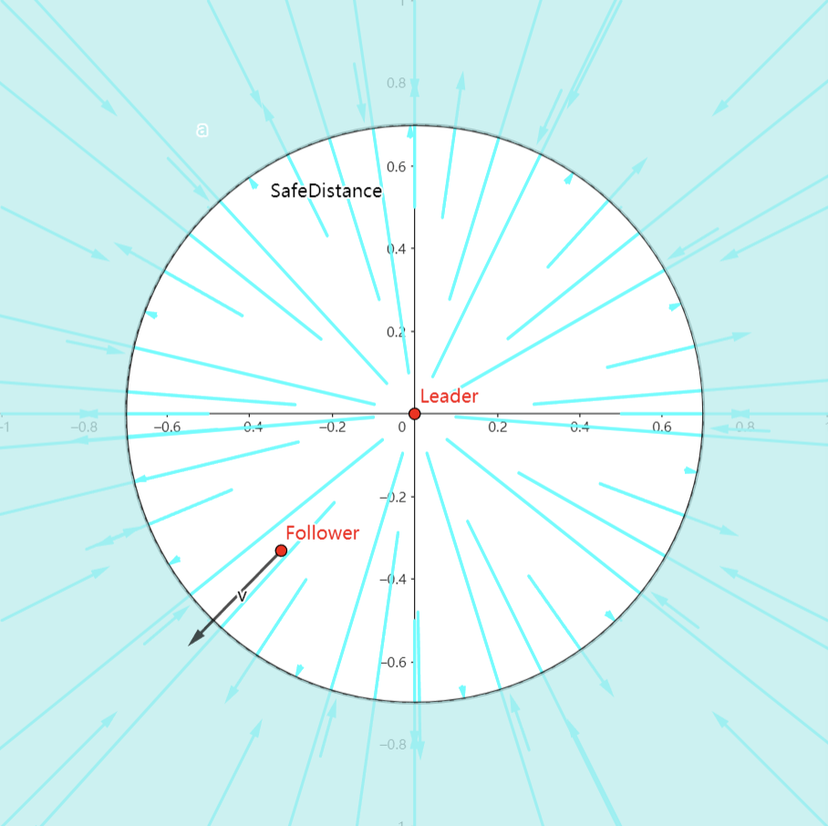

# 车辆智能控制

## 数据结构设计

物理量
$$
position=\begin{bmatrix}x_1 & y_1\\x_2 & y_2\\x_3 & ...\end{bmatrix}~~~~~~~~~
velocity=\begin{bmatrix}\omega_1 & \theta_1\\\omega_2 & \theta_2\\\omega_3 & ...\end{bmatrix}
$$

车道相对值，与全局坐标的线性变换
$$
车道纵向=\begin{bmatrix}a\\b\end{bmatrix}~~~~~~~~~车道横向=\begin{bmatrix}-b\\a\end{bmatrix}\\\\
R=\begin{bmatrix}a&-b\\b&a\end{bmatrix}~~~~~~~~
R^{-1}=\frac{1}{a^2+b^2}\begin{bmatrix}a&b\\-b&a\end{bmatrix}\\\\

相对向量\rightarrow全局向量：\vec{e}=R~\cdot~\vec{e'}\\
全局向量\rightarrow相对向量：\vec{e'}=R^{-1}\cdot~\vec{e}\\

车道M\rightarrow车道N：\vec{}
$$

## 功能设计

### 策略

- #### CAV分组策略

     某一时刻开始，统计一组要到同一车道的车辆

- #### 直行策略

     lane=get_lane时

     - 受变道车辆(to_lane)的a_x影响
     - 受同车道车辆(lane)的a_x影响

- #### 变道策略

     lane！=get_lane时
     
     - 受lane上车辆的a_y影响
     - 受所有车辆的a_x影响

### 趋势

- #### CAV组内对齐策略

     - 按照路口转向的方向进行分组，排列
          $$
          \Sigma~\alpha[(p_i-p_j-r_{ij})-\beta(v_i-v_j)]
          $$

- #### CAV避障

$$
\Sigma~\alpha[(p_i-p_j-r_{ij})-\beta(v_i-v_j)]\cdot
$$

- #### Leader变道偏向

- #### 前行趋势

- #### 限速刹车抑制

- #### 避障抑制

     CAV中的模块是无视距离全局持续影响的，是让车趋于一点的

     但避障的情况，是没有一个期望逼近的点R的，我们需要一个发散的力

     

     <figure style="width:45%">
         
         <figcaption style="text-align: center">CAV向量场</figcaption>
     </figure>
     <figure style="width:45%">
         
         <figcaption style="text-align: center">线性发散的向量场</figcaption>
     </figure>
     

     $$
     cav:~~\alpha_{ij}*((\vec{p_{ij}}-\vec{r_{ij}})-\beta_{ij}*(\vec{v_i}-\vec{v_j}))\\\\
     A1:~~-\alpha_{ij}*(\vec{p_{ij}}-\beta_{ij}*(\vec{v_i}-\vec{v_j}))
     $$

     

     改进后，发现其是由近及远增大的，我们需要一个由远及近增大的，并且屏蔽安全距离之外的力

     考虑到线性的抑制效果在车辆密度大的情况下不佳，改进成反比例的抑制效果，近距离抑制效果更强

     

     <figure style="width:45%">
         
         <figcaption style="text-align: center">线性抑制</figcaption>
     </figure>
     <figure style="width:45%">
         
         <figcaption style="text-align: center">反比例抑制</figcaption>
     </figure>
     

     

     $$
     Linear:~~-\alpha_{ij}*(\frac{\vec{p_{ij}}}{|\vec{p_{ij}}|}(d_{safe}-|\vec{p_{ij}}|)-\beta_{ij}*(\vec{v_i}-\vec{v_j}))\\\\
     Inverse~Ratio:-\alpha_{ij}*(\vec{p_{ij}}*(\frac{d^2_{safe}}{|\vec{p_{ij}}|}-d_{safe})-\beta_{ij}*(\vec{v_i}-\vec{v_j})))
     $$

     实验后，发现有如下问题：

     - 正常并列常速直行的车辆会受相互抑制
     - 仅受位置控制的抑制效果前瞻性不强
     - 无法躲避远距离高速目标
     - cav中的速度抑制项是一种“趋同化”的算法，无法做到高效的“躲避”

     所以，引入了附带速度与加速度向量的抑制方法

     - 正交程度系数
     - 距离抑制系数
     - 控制方向

     $$
     正切相似度，表示两速度向量的相交程度：sim_{tan} = \frac{tan<\vec{v}_{obj},\vec{v}_{target}>}{|\vec{p}_{ij}|}
     \\\\
     正弦相似度\frac{sin<\vec{v}_{obj}-\vec{v}_{target},\vec{p}_{obj->target}>}{}
     $$

     

     检测红绿灯

### 策略2

- a向量仅压制x，v向量压制x/y

- 直行车辆只受全局a_x影响

### 路口

